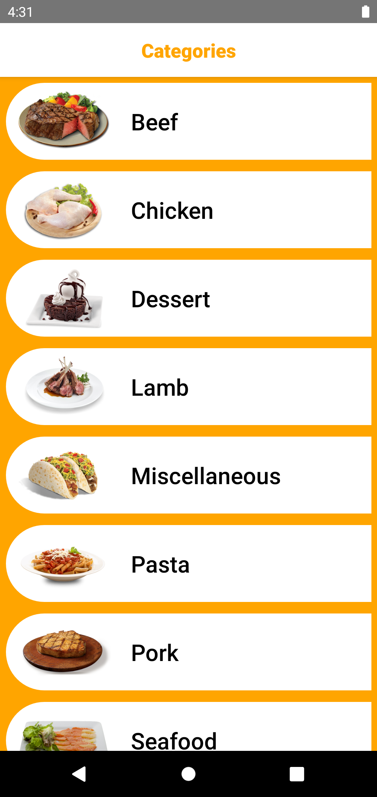

# myStoreApp

This is a simple News App. 
I used react native 0.65 version in this project.

<!DOCTYPE html>
<html>
  <head>
  </head>
  <body>
    <table>
    <tr>
    <td valign="top" width="33%">

  

</td>
<td valign="top" width="33%">

  

</td>
<td valign="top" width="33%">

  
</td>
</tr>
</table>
    <table>
    <tr>
<td valign="top" width="33%">

  
</td>
<td valign="top" width="33%">

            <video width="320" height="240" controls autoplay mute>
                <source src="./src/videos/1.mp4" type="video/mp4">
                Your browser does not support the video tag.
            </video>

  
</td>
</tr>
</table>
  </body>
</html>

